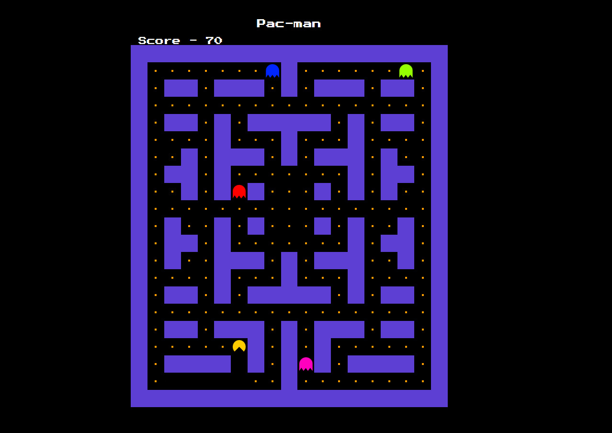

<div align="center">
<picture>
    
  </picture>
</div>

<div align="center">
  <h2>
    A open source pac-man rebuild game</br>
  </h2>
</div>

### To run the project locally

```npm run dev

```

## Features

- 🟦 Walls + pellets (food)
- 👻 4 ghosts moving around the maze
- 😋 Pac‑Man movement with collision detection
- 🧮 Score increases when pellets are eaten
- 🏁 Win condition when all food is collected
- 💀 Game Over on ghost collision
- 🔁 Restart support

## Controls

- ⬆️ Arrow Up: Move up
- ⬇️ Arrow Down: Move down
- ⬅️ Arrow Left: Move left
- ➡️ Arrow Right: Move right
- ⏎ Enter: Start game (when not started) / Restart game (after Game Over / Win)

## Note

- This game can be built with both canvas and grid system i have choosen grid as i worked before as well with vanilla js
